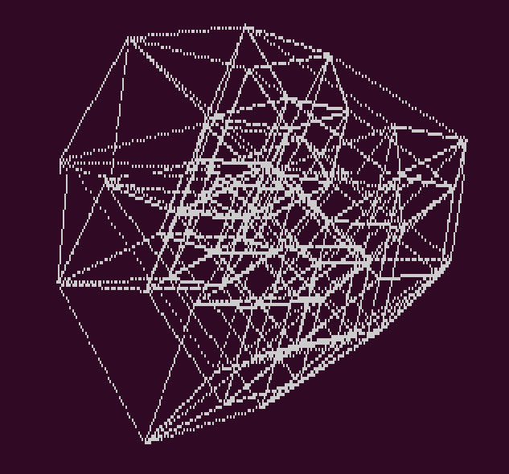

# Hypercube Wireframe

To compile with gcc: `gcc hypercubeWireframe.c -o hypercubeWireframe -lX11 -lm -Wall`

By default this renders a 4-cube (tesseract), to change the dimension of the hypercube modify `#define D` to the dimensionality of choice.

## 4-cube (tesseract)

## 6-cube

